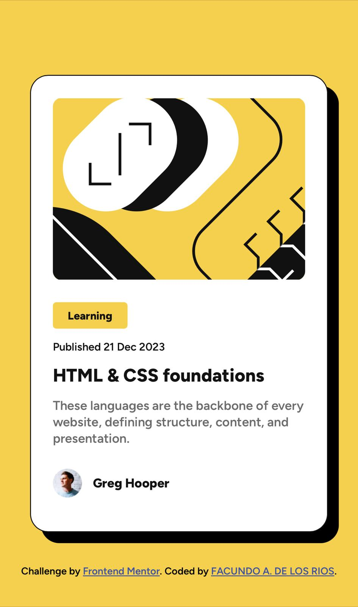

# Frontend Mentor - Blog preview card solution

This is a solution to the [Blog preview card challenge on Frontend Mentor](https://www.frontendmentor.io/challenges/blog-preview-card-ckPaj01IcS). Frontend Mentor challenges help you improve your coding skills by building realistic projects. 


## 📝 Table of contents

- [Overview](#overview)
  - [Screenshot](#screenshot)
  - [Links](#links)
- [My process](#my-process)
  - [Built with](#built-with)
  - [What I learned](#what-i-learned)
  - [Useful resources](#useful-resources)
- [Author](#author)

## Overview

### The challenge

Users should be able to:

- See hover and focus states for all interactive elements on the page

### 📸 Screenshot

**PC Screenshot**


**PC Hover effect Screenshot**


**Mobile Screenshot**



### 📎 Links

- Solution URL: [Github Repo](https://github.com/FacundoDLR/blog-preview-card-newbie.git)
- Live Site URL: [Live Demo](https://vercel.live/link/blog-preview-card-newbie.vercel.app?via=project-dashboard-alias-list&p=1)

## My process

### Built with

- Semantic HTML5 markup
- CSS custom properties
- Flexbox

### 🎓  What I learned

I leave here some code examples to apply @font-face as well as to apply a transition that serves to hover effect

```css
@font-face {
  font-family: 'Open Sans';
  font-style: normal;
  font-weight: 400;
  src:
    local("Open Sans"),
    url("/fonts/opensans.woff2") format("woff2"),
    url("/fonts/opensans.woff") format("woff"),
    url("/fonts/opensans.ttf") format("truetype");
}
```
```css
.element {
  width: 100px;
  height: 100px;
  background: red;
  transition: 2s;
}

.element:hover {
  background: blue;
}
```

### 💡 Useful resources

- [@font-face](https://lenguajecss.com/css/cargar-tipografias/regla-font-face/) - @font-face allows the author to specify online fonts to display on their web pages. By allowing authors to provide their own fonts, @font-face eliminates the need to rely on the limited number of user fonts installed on their computers.
- [Transitions CSS](https://developer.mozilla.org/es/docs/Web/CSS/CSS_transitions/Using_CSS_transitions) - CSS transitions are a very simple type of animation, where you establish the way in which one or more CSS properties will change.

## 🤩 Author

- GitHub - [FacundoDLR](https://github.com/FacundoDLR)
- Frontend Mentor - [@FacundoDLR](https://www.frontendmentor.io/profile/FacundoDLR)
